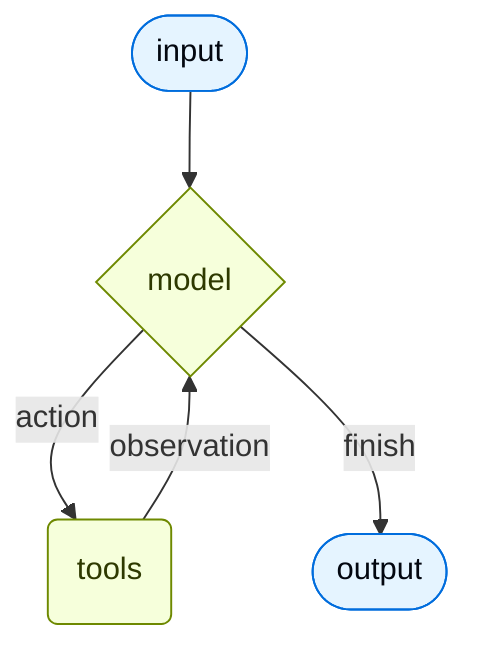

Agents combine language models with [tools](/oss/langchain/tools) to create systems that can reason about tasks, decide which tools to use, and work iteratively toward a solution. `create_agent()` provides a production-ready agent implementation built on [LangGraph](/oss/langgraph/overview).

An agent runs in a loop: the model receives messages, decides whether to call a tool, receives the tool result, and repeats until it produces a final answer.



## Create an agent

Pass a model identifier, tools, and an optional system prompt to `create_agent()`.

<Tabs>
  <Tab title="Python">
    ```python
    from langchain.agents import create_agent

    agent = create_agent(
        model="openai:gpt-5.4",
        tools=[],
        system_prompt="You are a helpful assistant.",
    )
    ```

    The model string uses the `provider:model` format. Use `init_chat_model` for more control over parameters like `temperature` or `timeout`:

    ```python
    from langchain.agents import create_agent
    from langchain_openai import ChatOpenAI

    model = ChatOpenAI(
        model="gpt-5.4",
        temperature=0.1,
        max_tokens=1000,
        timeout=30,
    )
    agent = create_agent(model, tools=[])
    ```
  </Tab>
  <Tab title="TypeScript">
    ```ts
    import { createAgent } from "langchain";

    const agent = createAgent({
      model: "openai:gpt-5.4",
      tools: [],
      systemPrompt: "You are a helpful assistant.",
    });
    ```

    For more control, pass a model instance directly:

    ```ts
    import { createAgent } from "langchain";
    import { ChatOpenAI } from "@langchain/openai";

    const model = new ChatOpenAI({
      model: "gpt-5.4",
      temperature: 0.1,
      maxTokens: 1000,
      timeout: 30,
    });

    const agent = createAgent({
      model,
      tools: [],
    });
    ```
  </Tab>
</Tabs>

## Add tools

Pass tools in the `tools` array. Each tool is a function the model can call to take action. See [Tools](/oss/langchain/tools) for how to define them.

<Tabs>
  <Tab title="Python">
    ```python
    from langchain.tools import tool
    from langchain.agents import create_agent

    @tool
    def search(query: str) -> str:
        """Search for information."""
        return f"Results for: {query}"

    @tool
    def get_weather(location: str) -> str:
        """Get weather information for a location."""
        return f"Weather in {location}: Sunny, 72°F"

    agent = create_agent(
        model="openai:gpt-5.4",
        tools=[search, get_weather],
        system_prompt="You are a helpful assistant.",
    )
    ```
  </Tab>
  <Tab title="TypeScript">
    ```ts
    import * as z from "zod";
    import { createAgent, tool } from "langchain";

    const search = tool(
      ({ query }) => `Results for: ${query}`,
      {
        name: "search",
        description: "Search for information",
        schema: z.object({
          query: z.string().describe("The query to search for"),
        }),
      }
    );

    const getWeather = tool(
      ({ location }) => `Weather in ${location}: Sunny, 72°F`,
      {
        name: "get_weather",
        description: "Get weather information for a location",
        schema: z.object({
          location: z.string().describe("The location to get weather for"),
        }),
      }
    );

    const agent = createAgent({
      model: "gpt-5.4",
      tools: [search, getWeather],
    });
    ```
  </Tab>
</Tabs>

## Invoke an agent

Call `agent.invoke()` with a message to get a response.

<Tabs>
  <Tab title="Python">
    ```python
    result = agent.invoke(
        {"messages": [{"role": "user", "content": "What's the weather in San Francisco?"}]}
    )
    print(result["messages"][-1].content_blocks)
    ```
  </Tab>
  <Tab title="TypeScript">
    ```typescript
    await agent.invoke({
      messages: [{ role: "user", content: "What's the weather in San Francisco?" }],
    });
    ```
  </Tab>
</Tabs>

## Stream agent output

Use `agent.stream()` to receive messages as they are produced rather than waiting for the final response.

<Tabs>
  <Tab title="Python">
    ```python
    from langchain.messages import AIMessage, HumanMessage

    for chunk in agent.stream({
        "messages": [{"role": "user", "content": "Search for AI news and summarize the findings"}]
    }, stream_mode="values"):
        latest_message = chunk["messages"][-1]
        if latest_message.content:
            if isinstance(latest_message, HumanMessage):
                print(f"User: {latest_message.content}")
            elif isinstance(latest_message, AIMessage):
                print(f"Agent: {latest_message.content}")
        elif latest_message.tool_calls:
            print(f"Calling tools: {[tc['name'] for tc in latest_message.tool_calls]}")
    ```
  </Tab>
  <Tab title="TypeScript">
    ```ts
    const stream = await agent.stream(
      {
        messages: [{
          role: "user",
          content: "Search for AI news and summarize the findings",
        }],
      },
      { streamMode: "values" }
    );

    for await (const chunk of stream) {
      const latestMessage = chunk.messages.at(-1);
      if (latestMessage?.content) {
        console.log(`Agent: ${latestMessage.content}`);
      } else if (latestMessage?.tool_calls) {
        const names = latestMessage.tool_calls.map((tc) => tc.name);
        console.log(`Calling tools: ${names.join(", ")}`);
      }
    }
    ```
  </Tab>
</Tabs>

## Multi-turn conversations

Add a checkpointer to maintain conversation history across multiple turns. Pass the same `thread_id` on each invocation to continue the same conversation.

<Tabs>
  <Tab title="Python">
    ```python
    from langchain.agents import create_agent
    from langchain.tools import tool
    from langgraph.checkpoint.memory import InMemorySaver

    @tool
    def get_weather(city: str) -> str:
        """Get weather for a given city."""
        return f"It's always sunny in {city}!"

    checkpointer = InMemorySaver()

    agent = create_agent(
        model="openai:gpt-5.4",
        tools=[get_weather],
        system_prompt="You are a helpful assistant.",
        checkpointer=checkpointer,
    )

    config = {"configurable": {"thread_id": "conversation-1"}}

    # Turn 1
    result = agent.invoke(
        {"messages": [{"role": "user", "content": "What's the weather in Paris?"}]},
        config=config,
    )
    print(result["messages"][-1].content_blocks)

    # Turn 2 — the agent remembers Paris from the previous turn
    result2 = agent.invoke(
        {"messages": [{"role": "user", "content": "What about London?"}]},
        config=config,
    )
    print(result2["messages"][-1].content_blocks)
    ```
  </Tab>
  <Tab title="TypeScript">
    ```ts
    import { createAgent, tool } from "langchain";
    import { MemorySaver } from "@langchain/langgraph";
    import * as z from "zod";

    const getWeather = tool(
      (input) => `It's always sunny in ${input.city}!`,
      {
        name: "get_weather",
        description: "Get the weather for a given city",
        schema: z.object({
          city: z.string().describe("The city to get the weather for"),
        }),
      }
    );

    const checkpointer = new MemorySaver();

    const agent = createAgent({
      model: "gpt-5.4",
      tools: [getWeather],
      checkpointer,
    });

    const config = { configurable: { thread_id: "conversation-1" } };

    // Turn 1
    const result = await agent.invoke(
      { messages: [{ role: "user", content: "What's the weather in Paris?" }] },
      config,
    );

    // Turn 2 — the agent remembers Paris from the previous turn
    const result2 = await agent.invoke(
      { messages: [{ role: "user", content: "What about London?" }] },
      config,
    );
    ```
  </Tab>
</Tabs>

<Note>
`InMemorySaver` is suitable for development and testing. In production, use a persistent checkpointer backed by a database. See [Persistence](/oss/langgraph/persistence) for details.
</Note>

## Configure the system prompt

The `system_prompt` parameter shapes how your agent approaches tasks.

<Tabs>
  <Tab title="Python">
    ```python
    agent = create_agent(
        model="openai:gpt-5.4",
        tools=[],
        system_prompt="You are a helpful assistant. Be concise and accurate.",
    )
    ```
  </Tab>
  <Tab title="TypeScript">
    ```ts
    const agent = createAgent({
      model: "gpt-5.4",
      tools: [],
      systemPrompt: "You are a helpful assistant. Be concise and accurate.",
    });
    ```
  </Tab>
</Tabs>

When no system prompt is provided, the agent infers its behavior from the messages directly.

<Tip>
Use [LangSmith](/langsmith/overview) to trace, debug, and evaluate your agents.
</Tip>

## Next steps

<CardGroup cols={3}>
  <Card title="Models" icon="cpu" href="/oss/langchain/models">
    Learn about the unified model interface, providers, and parameters.
  </Card>
  <Card title="Tools" icon="tool" href="/oss/langchain/tools">
    Define custom tools and use prebuilt tools from the integrations library.
  </Card>
  <Card title="LangGraph" icon="chart-dots" href="/oss/langgraph/overview">
    Access the low-level graph API for advanced orchestration patterns.
  </Card>
</CardGroup>
